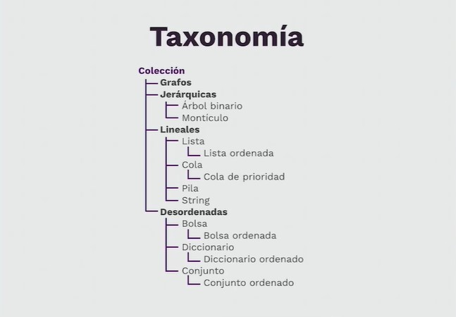

# Estructuras de datos

Las estructuras de datos son una forma de representar información. Así como usamos una variable de tipo array para representar un número finito de elementos, podemos representar una lista en una estructura de datos de tipo lista enlazada, esta estructura puede ser creada por nosotros o provista por una librería.

Las estructuras de datos no solo representan la información, también tienen un comportamiento interno, y se rige por ciertas reglas/restricciones dadas por la forma en que está construida internamente.

